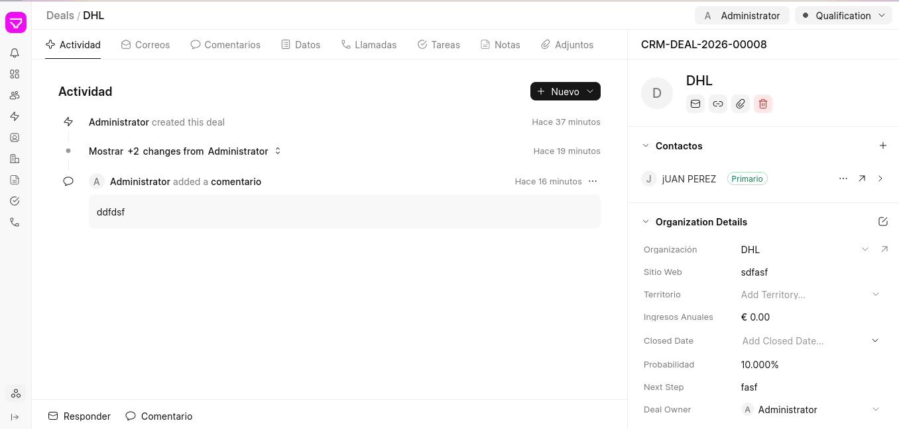

## Introducción

Este documento define el modelo de entidades de AURA, describiendo las principales entidades que intervienen en el sistema, sus campos, relaciones y reglas de negocio. Parte de estas entidades pertenecen de forma nativa a Frappe CRM o Frappe Framework (herramienta seleccionada para el desarrollo de AURA), mientras que otras serán incorporadas específicamente por AURA para adaptar el sistema al funcionamiento del subsistema de Partners de Hyperloop UPV.

A modo de resumen la siguiente tabla:

| AURA | Subsistema Partners Hyperloop UPV | Descripción |
|:---|:---|:---|
| `Organization` | Empresas | Diferentes organizaciones con las que el equipo tiene o ha tenido trato |
| `Contact` | Contacto | Miembros de las diferentes organizaciones con los que tiene relación el equipo |
| `Deal` | Patrocinio | Relación de patrocinio que mantiene Hyperloop UPV con otra organización, se forma mediante la interacción entre un Contacto (`Contact`) y un Agente de Partners (`User`). Se renuevan cada temporada (H9, H10, H11...) |
| `User` | Agente de Partners, y PM | Usuarios de AURA, responsables de los `Deal` y de interaccionar con los `Contact` de las empresas |
| `Admin`| Ø | Administrador de AURA, usuario técnico con experiencia en el desarollo de SW y conocimientos avanzados de redes y servidores |

: Correspondencia entre entidades de AURA y el subsistema de Partners {#tbl-entidades tbl-colwidths="[15,25,60]"}


## Organization

`Organization` representa una **empresa**, u otro tipo de organizción con la que Hyperloop UPV tiene o ha tenido relación (por ejemplo, *DHL* o *José Antonio García* ). Es una entidad permanente: no representa una temporada de patrocinio concreta, sino que agrupa el historial completo de esa empresa a lo largo de todas las temporadas. Es el punto de entrada principal para consultar la relación histórica con un partner, actuando como el expediente histórico de la organización.

### Esquema

::: {.content-visible when-format="pdf"}
**Tabla 2: Esquema de campos de `Organization`**
:::

```{=latex}
\renewcommand{\arraystretch}{1.35}
\begin{longtable}{|p{2.7cm}|p{2.1cm}|p{1.7cm}|p{8.5cm}|}
\hline
\textbf{Campo} & \textbf{Tipo} & \textbf{Requerido} & \textbf{Descripción} \\
\hline
\endfirsthead
\hline
\textbf{Campo} & \textbf{Tipo} & \textbf{Requerido} & \textbf{Descripción} \\
\hline
\endhead
\hline
\endfoot
\hline
\endlastfoot
Organization Name & Texto & Sí & Nombre de la empresa u organización. \\
\hline
Organization Logo & Imagen & No & Logo de la empresa, usado para identificarla visualmente en AURA. \\
\hline
País & Selección & Sí & País donde se ubica la empresa. \\
\hline
Dirección & Texto & No & Dirección postal de la sede de la empresa. \\
\hline
CIF & Texto & No & Código de Identificación Fiscal de la empresa. \\
\hline
Sitio web & Enlace & No & Página web oficial de la empresa. \\
\hline
Sector & Multi-selección & Sí & Etiquetas del sector de actividad de la empresa (ver apartado \textit{Propuesta de sectores}). Condiciona las especialidades disponibles (ver apartado \textit{Herencia Sector} $\rightarrow$ \textit{Especialidad}). \\
\hline
Especialidad & Multi-selección & No & Etiquetas del tipo de producto/servicio concreto que ofrece la empresa dentro de sus sectores (p.\,ej. dentro de \textit{Equipaciones + Merchandising}: tazas, libretas, camisetas...). Las opciones disponibles dependen de los sectores marcados en \texttt{Sector}. \\
\hline
UPV & Casilla & Sí & Indica si la organización tiene relación con la UPV (por ejemplo, un departamento, instituto o spin-off universitaria), para distinguirla de un patrocinador externo. \\
\hline
Notas & Texto largo & No & Observaciones libres sobre la empresa que no encajan en un campo estructurado (p.\,ej. preferencias de contacto, vínculos personales con la UPV, contexto histórico relevante). Clave para preservar memoria institucional entre generaciones. \\
\hline
\end{longtable}
\renewcommand{\arraystretch}{1}
```

La columna *Requerido* indica qué campos son necesarios para que el registro de la organización sea útil a largo plazo, pero no impide dar de alta una organización con solo el nombre y completar el resto de campos más adelante: no es necesario rellenar todos los datos en el momento del alta.


### Herencia Sector → Especialidad {#herencia-sector-especialidad}

`Sector` y `Especialidad` forman una jerarquía de dos niveles: cada `Especialidad` pertenece a uno o varios `Sector`. Una misma empresa puede pertenecer a varios sectores a la vez (p. ej. una empresa puede operar tanto en *Electrónica* como en *Mecanizados + Impresión 3D*), ya que `Sector` es un campo de selección múltiple. Del mismo modo, esa empresa puede tener marcadas varias especialidades a la vez, incluso de sectores distintos (p. ej. *tazas* dentro de *Equipaciones + Merchandising* y, si también opera en *Electrónica*, alguna especialidad propia de ese sector). Al marcar los `Sector` de una organización, `Especialidad` solo debe ofrecer como opciones las etiquetas que pertenecen a alguno de esos sectores, evitando combinaciones incoherentes (p. ej. no debería poder marcarse *tazas* si la empresa no pertenece al sector *Equipaciones + Merchandising*).

Los dos niveles de la jerarquía tienen un ciclo de vida distinto:

* `Sector` es una taxonomía cerrada, definida y mantenida por el `Admin`. Al ser pocos y estables, sus cambios deben ser deliberados para no romper la clasificación general de organizaciones.
* `Especialidad` es una taxonomía abierta: cualquier `User` puede crear una nueva etiqueta de especialidad (asociada a un `Sector` existente) a medida que la va necesitando al catalogar una organización, sin depender del `Admin`. Esto permite que el nivel de detalle crezca de forma progresiva y orgánica con el uso real del sistema.

Esto permite mantener el catálogo de sectores estable y controlado, a la vez que el catálogo de especialidades se enriquece progresivamente con el uso, manteniendo la relación de herencia consistente en toda la base de datos.

### Propuesta de sectores {#sectores-propuestos}

Como punto de partida para el catálogo de `Sector` mantenido por el `Admin`, se propone la siguiente lista *(extraída de la carpeta de necesidades del Drive de Partners de H11)*, ordenada alfabéticamente y dejando *Miscelánea* como categoría residual al final:

* Electromagnetics
* Electrónica
* Empresas Locales
* Equipaciones 
* Merchandising
* Materiales (*Carenado*, *Fibra*)
* Líquido
* Logística
* Mecanizados
* Impresión 3D
* Miscelánea

## Contact

`Contact` es la persona de contacto de las diferentes empresas, interacciona con los agentes de Partnes para lograr el patrocinio.

En principio los contactos no tienen que estár vinculados a las empresas, aun así es mejor que lo esten a la hora de estructurar el `Dealt`.

Los campos de los contactos se corresponden con los propios de una carpeta de contacto.

### Esquema

::: {.content-visible when-format="pdf"}
**Tabla 3: Esquema de campos de `Contact`**
:::

```{=latex}
\renewcommand{\arraystretch}{1.35}
\begin{longtable}{|p{2.7cm}|p{2.1cm}|p{1.7cm}|p{8.5cm}|}
\hline
\textbf{Campo} & \textbf{Tipo} & \textbf{Requerido} & \textbf{Descripción} \\
\hline
\endfirsthead
\hline
\textbf{Campo} & \textbf{Tipo} & \textbf{Requerido} & \textbf{Descripción} \\
\hline
\endhead
\hline
\endfoot
\hline
\endlastfoot
Nombre & Texto & Sí & Nombre de pila del contacto. \\
\hline
Apellido & Texto & No & Apellido(s) del contacto. \\
\hline
Género & Selección & No & Género del contacto. \\
\hline
Dirección de correo electrónico & Texto & No & Correo electrónico principal del contacto. \\
\hline
Número de Móvil & Texto & No & Teléfono móvil de contacto. \\
\hline
Nombre de la compañía & Enlace & No & Organización (\texttt{Organization}) a la que pertenece el contacto. \\
\hline
Departamento & Texto & No & Departamento o área de la empresa en el que trabaja el contacto. \\
\hline
\end{longtable}
\renewcommand{\arraystretch}{1}
```

Al igual que con las `organizations` para dar de alta a un contacto no es necesario completar todos los campos, se pueden ir rellenando los campos a medida que evolucione la relación.

## Deal

`Deal` representa la relación de patrocinio de una `Organization` durante **una temporada concreta** (p. ej. *DHL* en H11). A diferencia de `Organization`, que es permanente, cada `Deal` vive dentro de una temporada: toda la información que depende de la temporada (estado, categoría de patrocinio, contribuciones...) va aquí, no en la `Organization`. Una misma organización tiene un `Deal` distinto por cada temporada en la que ha habido relación con Hyperloop UPV.

El estado del `Deal` avanza a través de la máquina de estados descrita en el documento *Máquina de Estados*.

### Creación

Para la creación del `Dealt` será necesario completar los siguentes campos

Organization - Contact - Responsible -  Status -  Season


```{=latex}
\renewcommand{\arraystretch}{1.35}
\begin{longtable}{|p{2.7cm}|p{2.1cm}|p{1.7cm}|p{8.5cm}|}
\hline
\textbf{Campo} & \textbf{Tipo} & \textbf{Requerido} & \textbf{Descripción} \\
\hline
\endfirsthead
\hline
\textbf{Campo} & \textbf{Tipo} & \textbf{Requerido} & \textbf{Descripción} \\
\hline
\endhead
\hline
\endfoot
\hline
\endlastfoot
Organization & Enlace & Sí & Organización (\texttt{Organization}) a la que pertenece el \texttt{Deal}. \\
\hline
Contact & Enlace & No & Contacto (\texttt{Contact}) de la organización con el que se lleva la relación durante esta temporada. \\
\hline
Responsible & Enlace & Sí & Usuario (\texttt{User}) de AURA responsable del \texttt{Deal} durante esta temporada. \\
\hline
Status & Selección & Sí & Estado actual de la relación de patrocinio dentro de la máquina de estados (ver el documento \textit{Máquina de Estados}). \\
\hline
Season & Selección & Sí & Temporada a la que corresponde el \texttt{Deal} (H10, H11, H12...). \\
\hline
\end{longtable}
\renewcommand{\arraystretch}{1}
```

Al igual que con `Organization` y `Contact`, no es necesario rellenar todos los campos al crear el `Deal` más allá de los indicados en el apartado anterior: el `Contact` puede añadirse más adelante si aún no se conoce.

### Funcionalidades del Deal

::: {.content-visible when-format="pdf"}
**Figura 1: Vista de un `Deal` en el CRM**
:::



Al ser `Deal` una entidad nativa de Frappe CRM, AURA reutiliza directamente toda la funcionalidad estándar que ya trae su vista, sin necesidad de desarrollar nada a medida. De ahí podemos aprovechar:

- Actividad
- Correos
- Comentarios
- Datos
- Registro de llamadas
- Tareas (aquí entrarían las ventajas de partners)
- Notas
- Adjuntos

> **Tareas y Outreach.** Las tareas se pueden asignar a cualquier `User`, no solo al `Responsible` del `Deal`. Esto permite dar de alta a un miembro de Outreach como `User` y otorgarle acceso únicamente a las tareas, sin necesidad de gestionar el resto del `Deal`, para que se encargue de las *ventajas de partners*.

## User

`User` es la entidad nativa de Frappe Framework que representa a los miembros del equipo que usan AURA. No es una entidad propia de AURA, así que no le añadimos un esquema de campos como a `Organization`, `Contact` o `Deal`: se usan los campos estándar de usuario de Frappe (nombre, email, foto...).

Dentro del subsistema de Partners, un `User` puede tener alguno de estos perfiles:

* **Agente de Partners**: lleva una cartera de `Deal`, encargándose de contactar y negociar con las `Organization` que tiene asignadas.
* **PM (Project Manager)**: coordina al equipo de Partners, con visibilidad sobre todos los `Deal` de la temporada en curso, no solo los suyos.

## Admin

`Admin` es también un `User`, pero con acceso técnico completo a AURA (instalación, DocTypes, permisos, servidor...). No forma parte del subsistema de Partners ni tiene un esquema propio.
